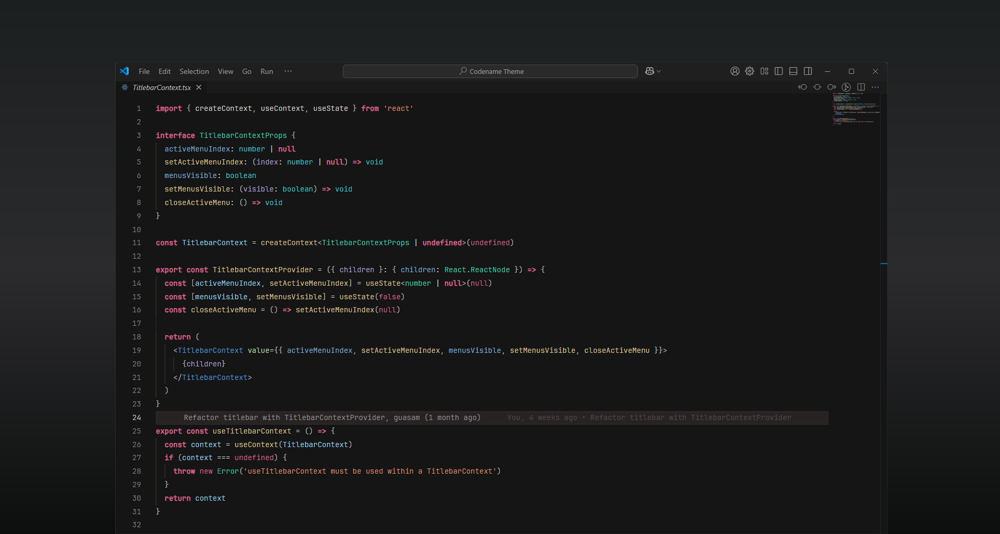

# Codename Theme

A sophisticated dark theme for Visual Studio Code with carefully selected colors that enhance code readability and reduce eye strain.

 

 

## Features

- 🎨 Modern dark color palette
- 💡 Carefully chosen semantic highlighting
- 🔍 High contrast for better readability
- 🎯 Optimized for long coding sessions
- ⚡ Distinct colors for different code elements

 

## Installation

1. Open VS Code
2. Go to Extensions view (`Ctrl+Shift+X` or `Cmd+Shift+X`)
3. Search for "Codename Theme"
4. Click Install

 

## Supported Syntax Colours

- Typescript / Javascript
- C#
- Swift
- HTML
- CSS
- JSON
- C++
- Java
- PHP